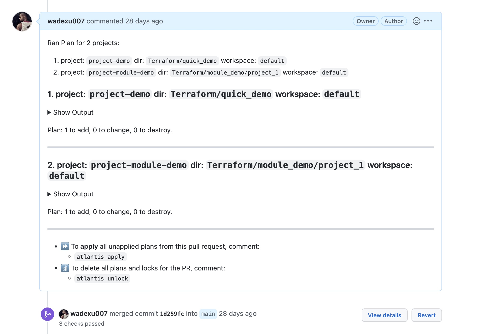

## What Is Atlantis?
[Atlantis](https://www.runatlantis.io/) is an application for automating Terraform via pull requests. It is deployed as a standalone application into your infrastructure. No third-party has access to your credentials.

This folder contains atlantis mainfests for deployment in kubernetes.

Reference: https://www.runatlantis.io/docs/deployment.html#kubernetes-kustomize

## Installation
#### Prerequisites
* A running kubernetes cluster
* Prepare a github user
* Prepare a [Personal Access Token](https://docs.github.com/en/authentication/keeping-your-account-and-data-secure/creating-a-personal-access-token#creating-a-token)
* Use any random string generator to create a [Webhook Secret](https://www.runatlantis.io/docs/webhook-secrets.html)

```
echo -n "" > ghUser
echo -n "" > ghToken
echo -n "" > ghWebhookSecret

kubectl create secret generic atlantis --from-file=ghUser --from-file=ghToken --from-file=ghWebhookSecret
```

#### Deployment
```
kustomize build sre-mgmt-dev > deploy.yaml  

kubectl apply -f deploy.yaml  
```

#### Config Ingress Nginx
Refer to Ingress Nginx [deployment](../Ingress-nginx/ingress-nginx-public/sre-mgmt-dev/)


#### Github webhook config
Reference: https://www.runatlantis.io/docs/configuring-webhooks.html#github-github-enterprise


#### Atlantis.yaml
Refer to [Atlantis.yaml](../atlantis.yaml) in this monorepo


#### Permimssion
Make sure service account of Atlantis running in GKE (in this example) has full permission to your demo GCP project so that it can manipulate resource in this GCP project.

* GKE default service account use node service account.

* (Optional) for GKE Workload Identity: https://cloud.google.com/kubernetes-engine/docs/how-to/workload-identity

## Workflow Test
* Step 1: Open a Pull Request
* Step 2: Atlantis automatically run `terraform plan` and comments back on PR
* Step 3: Someone reviews and approves PR
* Step 4: Comment `atlantis apply`
* Step 5: Atlantis run `terraform apply` and comments back on PR about result
* Step 6: PR merged automatically.



<br>
