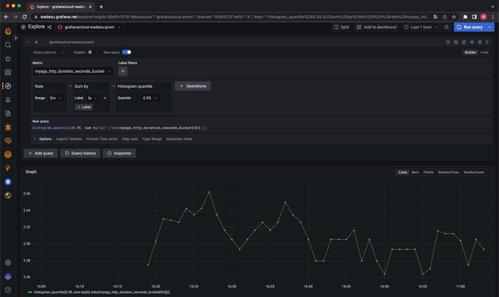
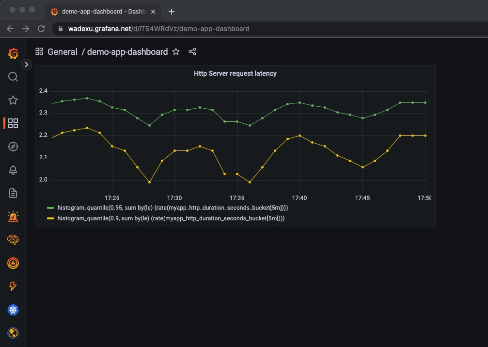

## Grafana Cloud Hosted Metrics Info
Go to Grafana Cloud Portal - Click `Details` of Prometheus 

You can see Instance Details.

## Sending Data to Grafana Cloud Metrics
To ship metrics to Grafana Cloud, you must have either Prometheus or the Grafana Cloud Agent already running in your environment and scraping your apps and services.

### Shipping metrics with Grafana Agent
Skip

### Shipping metrics with Prometheus
Prometheus `remote_write` Configuration should add to your Prometheus config.

Create a file named new_values.yaml
```
server:
  remoteWrite:
  - url: "https://prometheus-us-central1.grafana.net/api/prom/push"
    basic_auth:
      username: <your_grafana_cloud_metrics_username>
      password: <your_grafana_cloud_metrics_password>
```

* New Prometheus Installation with `remote_write` configuration
```
kubectl create namespace prometheus 

helm repo add prometheus-community https://prometheus-community.github.io/helm-charts

helm install my-prometheus prometheus-community/prometheus --namespace prometheus -f values.yaml
```

* Upgrade existing Prometheus with `remote_write` configuration
```
helm upgrade -f new_values.yaml my-prometheus prometheus-community/prometheus --namespace prometheus
```

Result
```
Release "my-prometheus" has been upgraded. Happy Helming!
NAME: my-prometheus
LAST DEPLOYED: Tue Nov 15 15:53:00 2022
NAMESPACE: prometheus
STATUS: deployed
REVISION: 2
TEST SUITE: None
...

For more information on running Prometheus, visit:
https://prometheus.io/
```

### Verify
```
kubectl get svc -n prometheus

kubectl --namespace prometheus port-forward svc/my-prometheus-server 9090:80
```

Navigate to http://localhost:9090 in your local browser, and then `Status` and `Configuration`. Verify that the `remote_write` block you created above has propagated to your running Prometheus instance configuration. It may take a couple of minutes for the changes to get picked up by the running Prometheus instance.


## Deploy an test app
Just [deploy this yaml](./demo-app.yaml) for my test app, source code here: [my exercise app](../../Golang/demo_app_with_prometheus/)

* Added [Prometheus Middleware for Gorilla Mux](https://www.robustperception.io/prometheus-middleware-for-gorilla-mux/)
* Added random seconds delay in HealthzHandler (Code commented out currently)

## View metrics in Grafana Cloud
Search for the trace in Grafana Cloud by navigating to Explore and choosing your prometheus data source. (prometheus datasource already added to Grafana Cloud automatically), add query then run.

e.g.
```
histogram_quantile(0.95, sum by(le) (rate(myapp_http_duration_seconds_bucket[5m])))
```



## Dashboard
Create a [dashboard](./http_latency_dashboard.json)



<br>