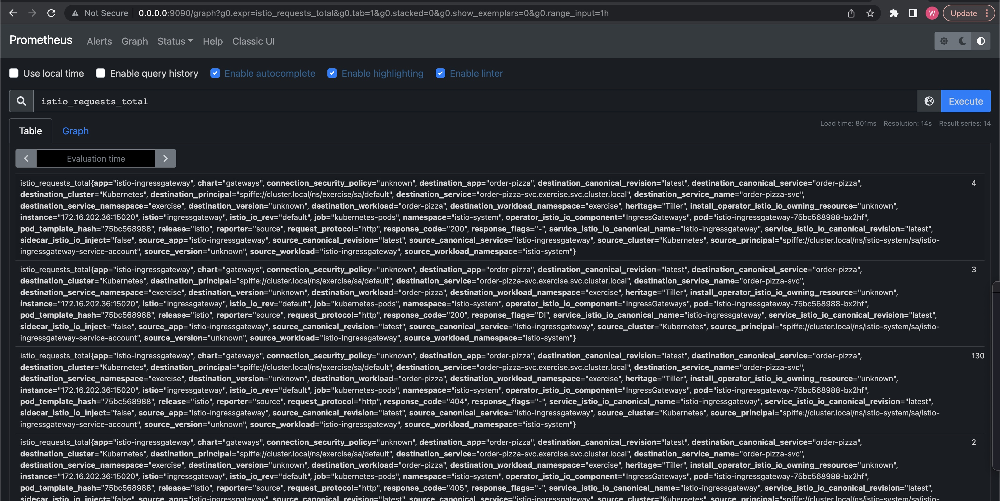
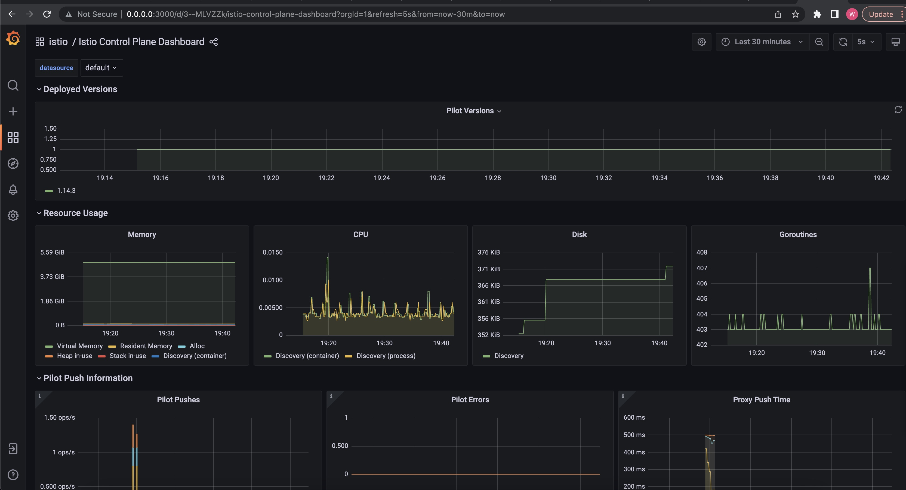
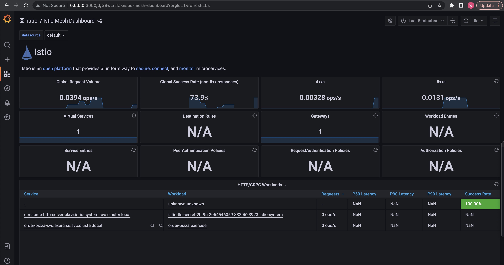
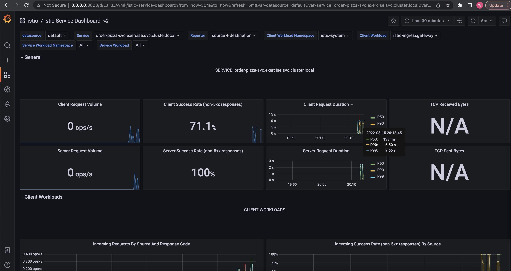
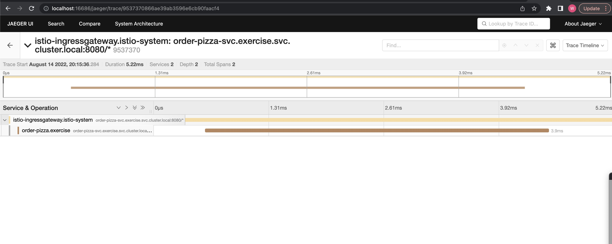

## Istio

[Istio](https://istio.io/) extends Kubernetes to establish a programmable, application-aware network using the powerful Envoy service proxy. Working with both Kubernetes and traditional workloads, Istio brings standard, universal traffic management, telemetry, and security to complex deployments.

Istio is an open source service mesh that layers transparently onto existing distributed applications. Istio’s powerful features provide a uniform and more efficient way to secure, connect, and monitor services. Istio is the path to load balancing, service-to-service authentication, and monitoring – with few or no service code changes. 

Its powerful control plane brings vital features, including: [Refer to Here](https://istio.io/latest/about/service-mesh/#what-is-istio)

### Prerequisites
* kubectl v1.19.0+
* istio 1.14.3
* cert-manager v1.8.2

### Installation
```
curl -L https://istio.io/downloadIstio | sh -
cd istio-1.14.3
cp bin/istioctl /usr/local/bin
istioctl install --set profile=demo -y
```

### Enable injection
```
kubectl create ns exercise

kubectl label ns exercise istio-injection=enabled

kubectl get ns -L istio-injection

NAME              STATUS   AGE     ISTIO-INJECTION 
dmz               Active   16d     
cert-manager      Active   24d     
default           Active   577d    
exercise          Active   28d     enabled
......
```

### Create a deployment
This is my demo app about [oder pizza](../Golang/simple_httpserver_mvcs/)
```
kubectl apply -f deployment.yaml

NAME                           READY   STATUS    RESTARTS   AGE
order-pizza-66b9dc5fbb-5d4fz   2/2     Running   0          50s
order-pizza-66b9dc5fbb-l7hdx   2/2     Running   0          50s
```

### Create VirtualService and Gateway
```
kubectl apply -f istio-specs.yaml

kubectl get gateway,vs -n exercise
NAME                                         AGE
gateway.networking.istio.io/httpsserver-gw   30s

NAME                                             GATEWAYS             HOSTS                              AGE
virtualservice.networking.istio.io/httpsserver   ["httpsserver-gw"]   ["istio-qw.wadexu.cloud"]   33s
```

### Configure DNS
Add a dns record for `istio-ingressgateway` external IP
```
kubectl -n istio-system get svc

NAME                   TYPE           CLUSTER-IP     EXTERNAL-IP
istio-egressgateway    ClusterIP      10.127.4.7     <none>
istio-ingressgateway   LoadBalancer   10.127.4.145   35.xx.xx.xx
istiod                 ClusterIP      10.127.4.214   <none> 
```

### Request SSL certificate
Refer to [cert-manager](../Kubernetes/cert-manager/) to install it first.
```
kubectl apply -f certificate-istio.yaml

kubectl get Certificate -n istio-system
NAME               READY   SECRET             AGE
istio-tls-secret   True    istio-tls-secret   12m

kubectl get secret -n istio-system
NAME                                               TYPE                                  DATA   AGE
istio-tls-secret                                   kubernetes.io/tls                     2      9m30s
```

### Test result
```
curl https://istio-gw.wadexu.cloud/healthz
[Info] Ping ok!
```

## Monitoring
```
kubectl apply -f istio-1.14.3/samples/addons/prometheus.yaml

kubectl apply -f istio-1.14.3/samples/addons/grafana.yaml

kubectl get po -n istio-system
NAME                                    READY   STATUS    RESTARTS   AGE
grafana-6c5dc6df7c-mr65n                1/1     Running   0          74s
prometheus-699b7cc575-c2rsx             2/2     Running   0          5m49s
```

Prometheus dashboard
```
istioctl dashboard prometheus --address 0.0.0.0
```



Envoy dashboard
```
istioctl dashboard envoy order-pizza-66b9dc5fbb-5d4fz.exercise --address 0.0.0.0
```

Grafana dashboard
```
istioctl dashboard grafana --address 0.0.0.0
```




## Tracing
```
kubectl apply -f jaeger.yaml
```

Tracing dashboard
```
istioctl dashboard jaeger
```


## Cleanup
```
killall kubectl

kubectl delete -f jaeger.yaml
kubectl delete -f istio-1.14.3/samples/addons/prometheus.yaml
kubectl delete -f istio-1.14.3/samples/addons/grafana.yaml
kubectl delete -f certificate-istio.yaml
kubectl delete -f istio-specs.yaml
kubectl delete -f deployment.yaml
```

## FAQ
### Issue 1
```
 Internal error occurred: failed calling webhook "namespace.sidecar-injector.istio.io": Post "https://istiod.istio-system.svc:443/inject?timeout=10s": context deadline exceeded
```
Private cluster need open ingress firewall to master node on port 15017.
https://istio.io/latest/docs/setup/platform-setup/gke/


### Issue 2
Need make 80 port open for issue certificate, otherwise met below issue `80 connection refused`.
<br>
Remove 80 port in `istio-specs.yaml` after certificate issued successfully.
```
kubectl get Challenge -n istio-system
kubectl describe Challenge istio-tls-secret-pcwqv-1479695378-696214653  -n istio-system

Waiting for HTTP-01 challenge propagation: failed to perform self check GET request 'http://istio-qw.wadexu.cloud/.well-known/acme-challenge/FVNEKXPmq5wrHofbbV8AhOrB-LZHG1znXpQsO61-NRw': Get "http://istio-qw.wadexu.cloud/.well-known/acme-challenge/FVNEKXPmq5wrHofbbV8AhOrB-LZHG1znXpQsO61-NRw": dial tcp 34.92.154.181:80: connect: connection refused
```

<br>